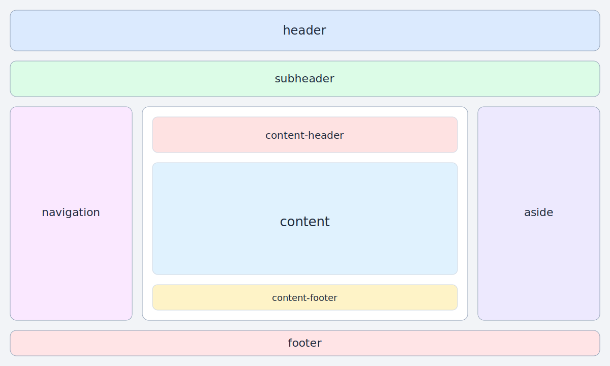
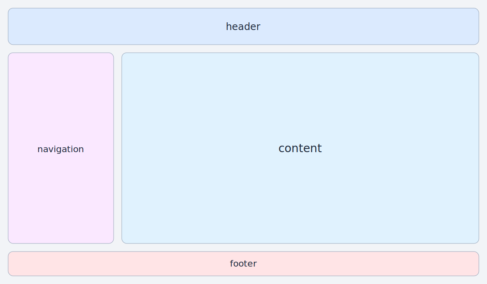
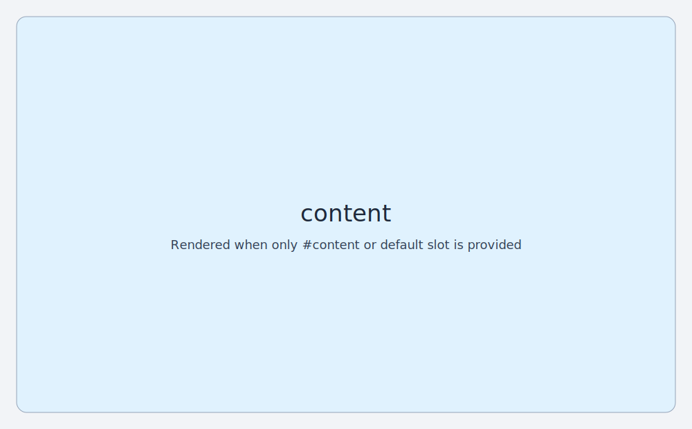

# LxPage

`LxPage` is a slot-driven page shell component that builds a CSS Grid layout based on which regions you provide.

It is designed for app-level screens and dashboards where sections such as header, navigation, content, aside, and footer are optional.

## Import

```ts
import { LxPage } from '@luaris/ui';
```

```ts
import { LxPage } from '@luaris/ui/components/page';
```

## Props

This component has no props.

## Emits

This component has no emits.

## Slots

| Slot | Description |
| --- | --- |
| `header` | Top page header row. |
| `subheader` | Secondary row under header (filters/tabs/breadcrumbs). |
| `navigation` | Left sidebar column. |
| `content-header` | Header row inside the content region. |
| `content` | Main content area. |
| `default` | Fallback content (rendered inside content main area with `content` slot). |
| `content-footer` | Footer row inside the content region. |
| `aside` | Right sidebar column. |
| `footer` | Bottom page footer row. |

## How Layout Works

`LxPage` computes its grid template dynamically in `usePage.ts`.

### 1. Root Grid Areas

Rows are generated in this order when slots exist:

1. `header`
2. `subheader`
3. main row (`navigation`, `content`, `aside` in columns)
4. `footer`

Columns are generated only for regions you provide:

- `navigation` column width: `var(--lx-size-layout-sidebar-width)`
- `content` column width: `1fr`
- `aside` column width: `var(--lx-size-layout-sidebar-width)`

### 2. Content Sub-grid

Inside the `content` area, another grid is generated:

1. `content-header` (auto)
2. `content` (fills remaining height via `minmax(0, 1fr)`)
3. `content-footer` (auto)

### 3. Conditional Rendering

Each slot region is only rendered when that slot exists.

If no `content` and no default slot are provided, the content region is omitted entirely.

## Visual Layout Diagrams

### Full Layout (all major slots)



### Header + Navigation + Content + Footer



### Content-only layout



## Theme Tokens Used

- `--lx-colour-surface-base`
- `--lx-colour-surface-raised`
- `--lx-colour-surface-border`
- `--lx-size-border-width-hairline`
- `--lx-size-radius-md`
- `--lx-size-space-sm`
- `--lx-size-layout-sidebar-width`

## Examples

### Minimal Content-only Page

```vue
<script setup lang="ts">
	import { LxPage } from '@luaris/ui';
</script>

<template>
	<LxPage>
		<template #content>
			<main style="padding: 1rem;">Main page content</main>
		</template>
	</LxPage>
</template>
```

### Typical App Shell

```vue
<script setup lang="ts">
	import { LxPage } from '@luaris/ui';
</script>

<template>
	<LxPage>
		<template #header>
			<header style="padding: 1rem;">App Header</header>
		</template>

		<template #navigation>
			<nav style="padding: 1rem;">Sidebar nav</nav>
		</template>

		<template #content-header>
			<div style="padding: 1rem;">Content toolbar</div>
		</template>

		<template #content>
			<section style="padding: 1rem;">Main dashboard</section>
		</template>

		<template #aside>
			<aside style="padding: 1rem;">Insights</aside>
		</template>

		<template #footer>
			<footer style="padding: 1rem;">Footer actions</footer>
		</template>
	</LxPage>
</template>
```

### Content Header + Footer Only

```vue
<script setup lang="ts">
	import { LxButton, LxPage } from '@luaris/ui';
</script>

<template>
	<LxPage>
		<template #content-header>
			<div style="padding: 1rem;">Editor</div>
		</template>

		<template #content>
			<div style="padding: 1rem; min-height: 16rem;">Editable content area</div>
		</template>

		<template #content-footer>
			<div style="padding: 1rem; display: flex; justify-content: flex-end; gap: 0.5rem;">
				<LxButton variant="secondary">Cancel</LxButton>
				<LxButton>Save</LxButton>
			</div>
		</template>
	</LxPage>
</template>
```

## Style Overrides

Use container-scoped overrides for page shell tuning:

```vue
<template>
	<LxPage class="admin-page">
		<template #content><div>Admin content</div></template>
	</LxPage>
</template>

<style scoped>
	.admin-page {
		padding: var(--lx-size-space-md);
		gap: var(--lx-size-space-md);
	}

	.admin-page :deep(.lx-page__content-main) {
		overflow: auto;
	}
</style>
```
